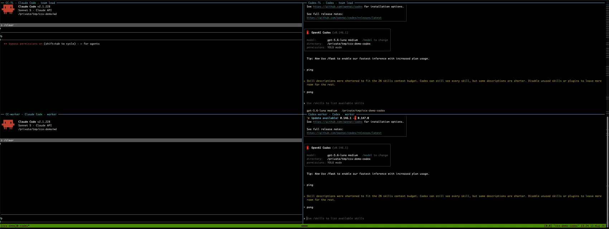

# ccx

Make **Codex threads and Claude Code sessions message each other** — by name,
in both directions, and Codex-to-Codex too — without patching or wrapping
either tool.

```
Claude session ──SendMessage──▶ stub socket ──turn/start──▶ Codex thread
Claude session ◀──one JSON line── ccx MCP ◀──peer_send(_meta)── Codex thread
```

A Claude session already discovers its peers by reading `~/.claude/sessions/`
and probing each advertised socket. ccx runs one small **stub process per live
Codex thread**: it owns a pid, binds a socket, and writes a matching
`<pid>.json`. That is enough to make a Codex thread an ordinary peer — it shows
up in `ListAgents`, it has a name, and `SendMessage` reaches it.

The other direction is an **MCP server** registered once with Codex. Every
`tools/call` Codex makes carries the calling thread's id, so one server serves
every thread and can stamp the right reply address.

The reply address is the same socket on both legs. Replying is literally
copying `from` into `to`. There is no routing table.



Four live sessions in one tmux grid — Claude Code left, Codex right, leads on
top. In order: Codex-TL lists its peers and sees both kinds; Codex-TL and
Codex-worker hold a conversation with no Claude session in the path; CC-TL's
`ListAgents` shows the Codex threads as ordinary peers; CC-TL and CC-worker
exchange native Claude messages, with no ccx involved; and Codex-TL messages
CC-TL across providers and gets a reply. Real sessions on real subscriptions,
cut down from six minutes — the waiting is what was removed.

## Install

Two commands per harness. ccx is Python 3.11+ and standard library only, so the
plugin directory *is* the install — there is nothing to build and nothing to
`pip install`.

```bash
# Codex — adds the peers_list and peer_send tools
codex plugin marketplace add thamam/ccx
codex plugin add ccx@ccx

# Claude Code — keeps the bridge daemon running
claude plugin marketplace add thamam/ccx
claude plugin install ccx@ccx
```

**The two sides install different things, on purpose.**

Codex gets the MCP server — that is where `peers_list` and `peer_send` are
needed. Claude gets one `SessionStart` hook and no MCP server at all: Claude
already has `ListAgents` and `SendMessage`, and `peer_send` could only ever
fail from a Claude session, because a Claude `tools/call` carries no Codex
thread metadata for ccx to derive a reply address from. A tool that exists only
to error is worse than an absent one.

The hook is idempotent, runs in about 40 ms, and if `python3` is missing it
logs to `$TMPDIR/ccx-daemon.log` and lets the session open normally.

The harnesses also read different manifests, so the repo ships both:
`.claude-plugin/plugin.json` (hook only) and `.codex-plugin/plugin.json` →
`.mcp.json`, whose paths are relative to the plugin root. Codex does **not**
substitute `${CLAUDE_PLUGIN_ROOT}`; the two formats are not interchangeable.

**Contributor install** — for working on ccx itself, or to get the `ccx` command
on your `PATH`:

```bash
pip install -e .
codex mcp add ccx -- ccx mcp     # only if you are not using the plugin
```

## Use

Nothing to start: the Claude-side hook brings up `ccx daemon`. To run it by
hand, or to launch a Codex session that can be reached:

```bash
ccx daemon              # keeps one stub per live Codex thread
ccx codex               # launch a Codex session that can RECEIVE messages
ccx codex --name vega   # ...and let peers address it as `vega`
```

Without `--name`, a Codex peer is called `codex-<cwd>-<thread>` — correct, and
not something anyone wants to type. `--name` sets the name on the thread itself
through the app-server, so every client agrees on it. If the name is already
taken the later thread gets the short thread id appended, because a name that
routes to one of two threads is worse than an ugly unique one.

Worth aliasing, because a plain `codex` session can send but can never be
reached:

```bash
alias codex='ccx codex'
```

**The launch asymmetry matters.** Sending works from any Codex session.
*Receiving* requires the session to be attached to the app-server daemon, which
is what `ccx codex` does — it is equivalent to

```bash
codex --remote unix://~/.codex/app-server-control/app-server-control.sock
```

A plain `codex` session cannot be reached, and will not appear in `ListAgents`.
Addressing one is reported as an error rather than swallowed.

**The ChatGPT desktop app is not covered.** Verified on 2026-08-10: the desktop
app runs its own IPC on `~/.codex/ipc/ipc.sock` and does not attach to the
app-server daemon, so with the daemon up, `thread/loaded/list` returns zero
threads while the app is running. ccx can neither see nor reach desktop
sessions. This is the terminal `codex` CLI only.

From a Codex session, the two tools the plugin adds:

- `peers_list` — every session you can reach, each tagged `[claude]` or
  `[codex]`, with its address. You are never listed as your own peer.
- `peer_send(to, message, summary)` — send to one, by name or address

**Codex threads are peers too.** They become addressable through exactly the
same stubs, so two Codex sessions can hold a conversation with each other, and
an incoming message says which kind of peer it came from rather than assuming
Claude.

From a Claude session: `ListAgents` and `SendMessage`, unchanged — ccx adds no
tools there and none are needed. Codex peers are named `codex-<cwd>-<thread>`
and stamped `from-name="codex:<thread>"`, so you can tell you are not talking
to another Claude session.

## When something stops working

```bash
ccx doctor
```

Both surfaces are **internal and undocumented**. Claude's `uds:` scheme,
registry shape and envelope are 2.1.226 internals; Codex's app-server is
labelled `[experimental]`. `ccx doctor` exercises all four contracts ccx stands
on and names the one that moved:

| check | contract |
|---|---|
| `claude-socket` | bind a socket + drop `<pid>.json` + a message round-trips |
| `claude-registry` | peers are discovered by reading the sessions dir and probing |
| `codex-rpc` | WebSocket JSON-RPC `initialize` + `thread/loaded/list` |
| `mcp-meta` | `_meta['x-codex-turn-metadata'].thread_id` still identifies the caller |

Everything it knows is written down in `docs/protocol-notes.md`. If a contract
moved, fix it there and in `ccx doctor` rather than rediscovering it.

## Tests

```bash
ccx e2e
```

No unit tests, no mocked sockets, no fake app-server. Every scenario drives a
real `claude` process and a real `codex` TUI on real subscriptions, and asserts
against real transcripts. A test that can pass while the product is broken is
the wrong test.

Runs are isolated and leave nothing behind: a scratch `CLAUDE_CONFIG_DIR`, a
scratch `CLAUDE_CODE_TMPDIR` for sockets, and a scratch `CODEX_HOME` with its
own app-server daemon. The suite fails a scenario that leaks anything into
`~/.claude/sessions`, `/tmp/cc-socks`, or the user's Codex daemon — including
when it is killed mid-run.

| scenario | what it proves |
|---|---|
| `m0-isolation` | an isolated Claude session registers as a peer, then vanishes without trace |
| `m1-codex-inject` | a turn injected over the app-server socket renders in a real Codex TUI |
| `m2-claude-sees-codex` | Claude lists a Codex thread and messages it; the daemon dies clean |
| `m3-round-trip` | Codex → Claude → back into the *same* Codex thread |
| `m4-receipts` | a held message reports `HELD`, then `DELIVERED`, into the Codex thread |
| `m5-hardening` | doctor agrees with reality; an unreachable peer errors |
| `m6-conversation` | a three-message conversation in both directions, addressed only by received addresses |
| `m7-plugin-install` | a real install: Codex gets the MCP tools, Claude gets only the hook, and the hook alone brings the bridge up |
| `m8-codex-to-codex` | two Codex threads discover each other, message both ways, and neither can address itself |
| `m9-chosen-names` | `--name` is honoured, addressable, and a name collision stays unambiguous |

## What this is not

Not an agent-orchestration framework. Two verbs: list, send. Not multi-user,
not multi-host, no network transport — local Unix sockets, same user, `0600`,
the same posture Claude already uses.

What it does add is **reach**: a Codex session can now type into a Claude
session. That is the feature, and it is also the risk. A Codex peer sits
entirely outside Claude's permission model, which is why messages carry an
honest `from-mode` attestation and say in the body that they come from Codex.

That last part is not decoration. Claude Code prefixes every inbound peer
message with "Another Claude session sent a message" regardless of who sent it,
and no envelope attribute outranks a sentence in the prompt — a rehearsal had a
Claude session read a correctly stamped message and describe it as coming from
another Claude session. So ccx states the provenance in the message body and
names that framing as inaccurate — but only when the recipient is a Claude
session. A Codex thread has no such framing to correct, and telling it
otherwise would be a false statement about its own harness. `m11-provenance` asserts what the receiving
model *says*, because the envelope was already right when the outcome was
wrong.
